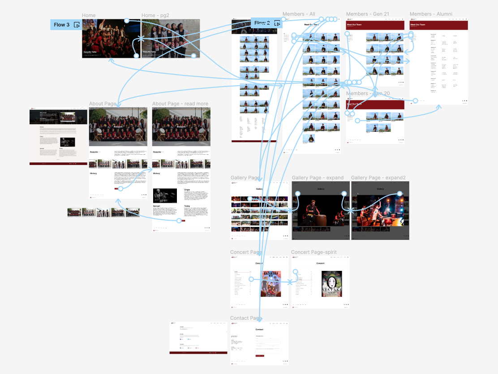
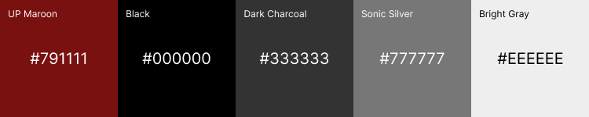

# Asayake Taiko Website Renewal

This project encompassed a complete overhaul of Asayake Taiko's existing [website](https://asayaketaiko.ucsd.edu/).
The primary objectives were to enhance the website's visual appeal, optimize functionality, and elevate the overall user experience.

## DEMO: Before and After

## Tech

## Key Highlights

- Redesigned the website to provide a fresh and modern look.
- Improved user experience by optimizing navigation and layout.
- Implemented new functionalities to enhance user engagement.

## Design

### Prototype

### Color Palette

- UP Maroon (the brand color): `#791111`
  - This color is directly derived from the Asayake Taiko logo, serving as a key element to maintain visual consistency with the team's identity.
- Black (primary/body text): `#000000`
- Dark Charcoal (subtitle text) : `#333333`
- Sonic Silver (secondary text): `#777777`
- Bright Gray: `#EEEEEE`
  - This color is mainly used for separators/dividers.

### Typography

## Author

- Jii Yoo ([github/rolemadelen](https://github.com/rolemadelen))

## License

Copyright © 2023, Jii Yoo. Released under the [MIT License](./LICENSE).

**Note:** Images used in this project belong to 'Asayake Taiko' and are used with permission or according to their respective licenses.
